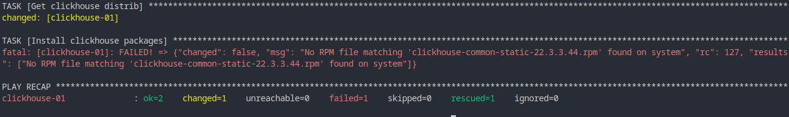

# Ответы на домашнее задание к занятию "08.02 Работа с Playbook"

## Подготовка к выполнению

1. (Необязательно) Изучите, что такое [clickhouse](https://www.youtube.com/watch?v=fjTNS2zkeBs) и [vector](https://www.youtube.com/watch?v=CgEhyffisLY)
2. Создайте свой собственный (или используйте старый) публичный репозиторий на github с произвольным именем.
3. Скачайте [playbook](./playbook/) из репозитория с домашним заданием и перенесите его в свой репозиторий.
4. Подготовьте хосты в соответствии с группами из предподготовленного playbook.

Ответ: Подготовку выполнил, для реализации использовал виртуальные машины создаваемые через Vagrant.  
## Основная часть

1. Приготовьте свой собственный inventory файл `prod.yml`.
Ответ: Выполнено.
```
---
clickhouse:
  hosts:
    clickhouse-01:
      ansible_host: 127.0.0.1
      ansible_port: 2222
      ansible_ssh_user: vagrant
      ansible_ssh_private_key_file: /home/yolo/PycharmProjects/addrepos/vagrant/.vagrant/machines/clickhouse/virtualbox/private_key
vector:
  hosts:
    vector-01:
      ansible_host: 127.0.0.1
      ansible_port: 2200
      ansible_ssh_user: vagrant
      ansible_ssh_private_key_file: /home/yolo/PycharmProjects/addrepos/vagrant/.vagrant/machines/vector/virtualbox/private_key
```
2. Допишите playbook: нужно сделать ещё один play, который устанавливает и настраивает [vector](https://vector.dev).
Ответ: Выполнено.
```
- name: Install Vector
  hosts: vector
  handlers:
    - name: reStart vector service
      become: true
      ansible.builtin.service:
        name: vector
        state: restarted
  tasks:
    - name: Install vector service
      block:
        - name: Get vector distrib
          ansible.builtin.get_url:
            url: "https://packages.timber.io/vector/{{ vector_version }}/vector-{{ vector_full_version }}.x86_64.rpm"
            dest: "./vector-{{ vector_full_version }}.x86_64.rpm"
            mode: 0744
    - name: Install vector packages
      become: true
      ansible.builtin.yum:
        name:
          - vector-{{ vector_full_version }}.x86_64.rpm
    - name: Copy vector config file
      become: true
      ansible.builtin.copy:
        src: templates/vector.toml
        dest: /etc/vector/vector.toml
        mode: 0644
      notify: reStart vector service
```
3. При создании tasks рекомендую использовать модули: `get_url`, `template`, `unarchive`, `file`.
4. Tasks должны: скачать нужной версии дистрибутив, выполнить распаковку в выбранную директорию, установить vector.
5. Запустите `ansible-lint site.yml` и исправьте ошибки, если они есть.
Ответ: Линтер указал на ошибки об отсутвии прав на скаченные файлы и на отсутвие наименования некоторых элементов.  
Все исправил, сейчас проверка проходит без ошибок.  
6. Попробуйте запустить playbook на этом окружении с флагом `--check`.  
Ответ: Упал в ошибку на шаге установки пакетов Clickhouse т.к. не нашел их в системе.  
  
7. Запустите playbook на `prod.yml` окружении с флагом `--diff`. Убедитесь, что изменения на системе произведены.  
Ответ: Все выполнилось корректно без ошибок, продемонстрированы в консоле изменения в конф. файлах.  
  
8. Повторно запустите playbook с флагом `--diff` и убедитесь, что playbook идемпотентен.  
Ответ: Повторно запустил, результат не изменился, все внесененные изменения подтвердились.  
    
Дополнительно проверим что все работает.
  
9. Подготовьте README.md файл по своему playbook. В нём должно быть описано: что делает playbook, какие у него есть параметры и теги.  
Ответ: Файл подготовлен. [Ознакомиться](playbook/README.md).  
10. Готовый playbook выложите в свой репозиторий, поставьте тег `08-ansible-02-playbook` на фиксирующий коммит, в ответ предоставьте ссылку на него.
Ответ: Ссылка на фиксирующий коммит с тегом https://github.com/IABeresnev/ansible-net-good/releases/tag/08-ansible-02-playbook  

---

### Как оформить ДЗ?

Выполненное домашнее задание пришлите ссылкой на .md-файл в вашем репозитории.

---
